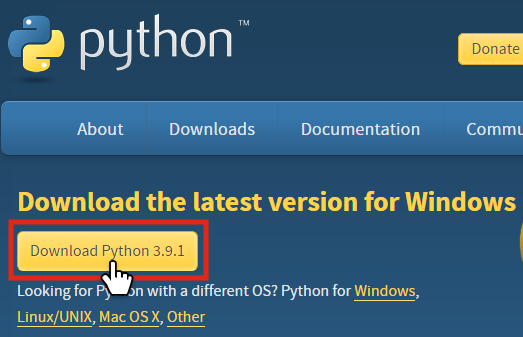
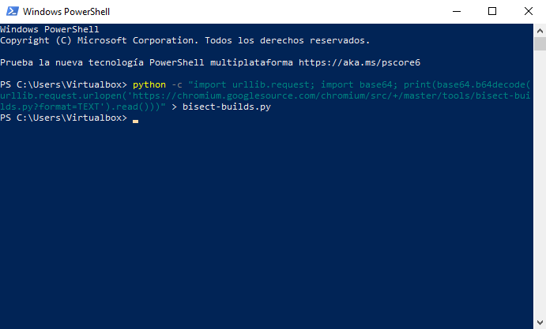

# Cómo hacer una bisección de Chromium

¿Alguna vez has visto un bug de tipo "regresión" como el siguiente? "_En
Chromium 86.0.4240.193, esto falla. Pero si me voy atrás y uso Chromium
85.0.4183.121, todo funciona bien_". Una buena manera de diagnosticar bugs
como estos –donde no está claro qué cambio podría haber causado la regresión,
pero puedes reproducir consistentemente el problema en una versión nueva,
pero no en una antigua– es hacer una **bisección**.

??? info "¿Qué es Chromium?"
    Chromium es el navegador en el que se basa Chrome. Chromium es un navegador
    de código abierto (su código se puede leer por cualquier persona y cualquier
    persona puede contribuir cambios), al contrario de Chrome, que es una
    versión de Chromium personalizada por Google con más funciones (y el código
    de estas no es accesible).

    En resumen: _Chrome = Chromium + modificaciones de Google_.

    En realidad, Chromium y Chrome son casi idénticos, puesto que las
    modificaciones son pocas, pero una de las cosas relevantes es que las
    versiones antiguas de Chromium se pueden descargar, mientras que Google no
    ofrece enlaces de descarga de las versiones antiguas de Chrome.

    Así pues, podemos hacer la bisección con Chromium, pero no con Chrome.

## Instrucciones para hacer la bisección

### Preparación

Antes de hacer la bisección, hay que instalar la herramienta que nos permitirá
hacer la bisección. Ya que la herramienta usa Python, instalaremos Python, y luego descargaremos la herramienta. Para hacerlo, sigue los siguientes pasos
(escoge tu sistema operativo aquí debajo):

=== "Windows"
    1. Ve a la página
    [https://www.python.org/downloads/](https://www.python.org/downloads/).
    Allí, haz clic en el botón **Download Python [...]** para descargar Python.
    <div style="text-align: center;"><a href="../../../img/py_download_win.png" target="_blank" rel="noopener nofollow"></a></div>

    2. Ahora ejecuta el archivo que se ha descargado, y en la ventana que se
    abre asegúrate de seleccionar la opción **Add Python to PATH**.
         - La opción que está justo arriba (**Install launcher for all users**)
         determina si la instalación se realizará para todos los usuarios del
         ordenador. Esto requiere permisos de administrador, así que si no los
         tienes deberás desactivar esta opción.
    3. Una vez configurado esto, haz clic en el botón **Install Now**.
    4. Cuando se acabe de configuar, haz clic en **Close**.
    5. Ahora que está instalado Python, procedemos a descargar la herramienta
    para hacer bisecciones. Para ello, haz clic derecho en el menú de Windows y
    selecciona la opción **Windows PowerShell** para abrir PowerShell.
    6. En la ventana que aparece, copia y pega el siguiente comando usando la
    combinación de teclas ++ctrl+v++ y pulsa ++enter++ para ejecutarlo:
    ```
    python -c "import urllib.request; import base64; print(base64.b64decode(urllib.request.urlopen('https://chromium.googlesource.com/chromium/src/+/master/tools/bisect-builds.py?format=text').read()).decode())" | Out-File -FilePath bisect-builds.py -Encoding utf8
    ```
    <div style="text-align: center;"><a href="../../../img/bisect_tool_install_win.png" target="_blank" rel="noopener nofollow"></a><br><span style="color: gray;">[haz clic encima de las imágenes para hacerlas más grandes]</span></div>

    7. El resultado será que en la carpeta actual (por defecto es la principal
    del usuario) se habrá descargado un archivo llamado `bisect-builds.py`, que
    es la herramienta para hacer bisecciones.

=== "macOS"
    1. Ve a la página
    [https://www.python.org/downloads/](https://www.python.org/downloads/).
    Allí, haz clic en el botón **Download Python [...]** para descargar Python.
    <div style="text-align: center;"><a href="../../../img/py_download_win.png" target="_blank" rel="noopener nofollow"></a></div>

    2. Ahora ejecuta el archivo que se ha descargado, y sigue los pasos para
    instalar Python.

    3. Una vez acabada la instalación, abre la aplicación que viene en tu Mac
    llamada **Terminal**.

    4. En la **Terminal**, ejecuta el siguiente comando para descargar la
    herramienta para hacer la bisección (cópialo allí y pulsa ++enter++):
    ```
    curl -s --basic -n "https://chromium.googlesource.com/chromium/src/+/master/tools/bisect-builds.py?format=TEXT" | base64 -D > bisect-builds.py
    ```

    5. El resultado será que en la carpeta actual (por defecto es la principal
    del usuario) se habrá descargado un archivo llamado `bisect-builds.py`, que
    es la herramienta para hacer bisecciones.

=== "Linux"
    1. Instala Python desde tu gestor de paquetes. Por ejemplo, en
    distribuciones basadas en Debian puedes hacerlo así desde la terminal
    (ábrela con la combinación de teclas ++ctrl+alt+t++, introduce el siguiente
    comando y pulsa la tecla ++enter++):
    ```
    sudo apt update && sudo apt install python3
    ```
    2. Una vez instalado Python, procedemos a descargar la herramienta que nos
    permitirá hacer la bisección. Para ello, ejecuta este otro comando en la
    terminal:
    ```
    curl -s --basic -n "https://chromium.googlesource.com/chromium/src/+/master/tools/bisect-builds.py?format=TEXT" | base64 -d > bisect-builds.py
    ```

    3. El resultado será que en la carpeta actual (por defecto es la principal
    del usuario) se habrá descargado un archivo llamado `bisect-builds.py`, que
    es la herramienta para hacer bisecciones.

### Empezar la bisección

Para hacer una bisección, sigue los siguientes pasos:

1. En la terminal que hemos abierto anteriormente (en Windows se llama
PowerShell), ejecuta el siguiente comando:
   ```
   python bisect-builds.py -a plataforma -g versión_buena -b versión_mala --verify-range
   ```
    - Debes sustituir `plataforma` por tu sistema operativo: `mac64`, `win64`,
      `linux64` o `linuxarm` (en el caso que tu sistema sea de 32-bits, debes
      poner `mac`, `win` o `linux`).
    - Debes sustituir `versión_buena` por una versión antigua que funcionaba
      correctamente y `versión_mala` por una versión nueva donde ya no funciona
      correctamente. Puede ser una versión específica como por ejemplo
      `87.0.4280.67`, o `M86` para referirse a la última versión de Chromium 86.
2. Al ejecutarlo, la herramienta empezará a descargarse una lista de versiones
   que existen entre las dos que le hemos dado. Luego, nos hará probar si en
   diferentes versiones de Chrome existe el problema o no.<br>
   Lo bueno de esta herramienta es que es tan inteligente que, aunque existan un
   montón de versiones de Chrome, optimiza el proceso para que solo tengamos que
   probar en unas pocas.<br>
   Para ello, la herramienta nos hará seguir los siguientes pasos repetidamente:
     1. Aparece `Trying revision {número}...` en la terminal y se abre una
        ventana de Chromium.
     2. Ahora, debemos intentar reproducir el error en la ventana de Chromium
        que se ha abierto.
     3. Una vez hayamos comprobado si el problema existe en esa versión o no,
        cerramos Chromium.
     4. En la terminal ahora aparecerá el mensaje `Revision {número} is
        [(g)ood/(b)ad/(r)etry/(u)nknown/(s)tdout/(q)uit]:`. Debemos introducir
        una de las siguientes letras y pulsar ++enter++ para indicar a la
        herramienta cómo ha ido la prueba:
         - **g** (_good_, en español: buena): esta versión era buena, es decir,
           el problema **no** está presente en esta versión.
         - **b** (_bad_, en español: mala): esta versión era mala, es decir, el
           problema está presente en esta versión.
         - **r** (_retry_, en español: reintentar): vuelve a abrir la ventana de
           Chromium de esta versión para que puedas volver a probar.
         - **u** (_unknown_, en español: no conocido): no sabes si en esta
           versión se encuentra el problema o no.
      5. Se repetirá esto unas cuantas veces (puedes ver que en la
         terminal aparece `roughly {n} steps lefs`, donde `{n}` es el número
         de pasos que quedan por terminar aproximadamente).
3. Una vez terminado, aparecerá un texto parecido al siguiente:
```
You are probably looking for a change made after 384820 (known good), but no later than 384821 (first known bad).
CHANGELOG URL:
https://chromium.googlesource.com/chromium/src/+log/a7afaf4f40dd9febabd6a0ebcfa1fdc9e1a890ea..f217f60c51bed92efd5cba86860a7a9909148c61
```
Esto es justamente lo relevante: da las dos revisiones donde se produce el
cambio que genera el error (en este caso el cambio de `384820` a `384821`) y una
URL donde se pueden ver todos los cambios hechos entre estas dos revisiones.

---

_Este documento es una traducción y adaptación del documento [https://www.chromium.org/developers/bisect-builds-py](https://www.chromium.org/developers/bisect-builds-py), disponible bajo la licencia [Creative Commons Attribution 2.5](https://creativecommons.org/licenses/by/2.5/) (The Chromium Authors)_
