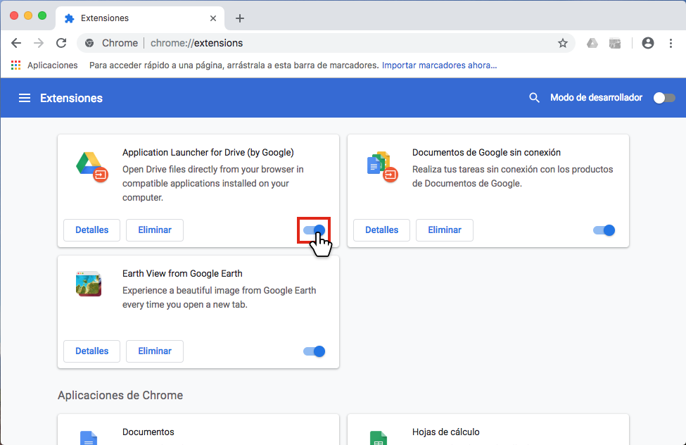

# Cómo inhabilitar las extensiones de Chrome para descubrir la fuente del problema
¡Hola a todos!

A veces las extensiones de Chrome se comportan de una manera que no deseamos. Por ejemplo, algunas sobrecargan de anuncios las páginas web que visitamos o hacen que las páginas web no se carguen correctamente. Así pues, si inhabilitamos las extensiones una a una podremos descubrir si alguna extensión está provocando esto.

Para ello sigue los siguientes pasos:

1. Accede a `chrome://extensions` (copia y pega esta URL en la barra de direcciones de Chrome y pulsa enter)
2. **Haz clic en el control deslizante** que hay en la esquina inferior derecha de la tarjeta de la primera extensión **para desactivarla**.

3. Prueba ahora si Chrome se comporta de la manera indeseada. Si todavía se comporta mal, **deberás inhabilitar la siguiente extensión, hasta encontrar la culpable**.
4. Cuando veas que Chrome ya se comporta correctamente, entonces has encontrado la extensión culpable. Haz clic en el botón **Eliminar** para eliminarla.

Si al inhabilitar todas las extensiones, Chrome se sigue comportando de una manera indeseada, eso significa que la fuente del problema no son las extensiones, sino otra cosa.
