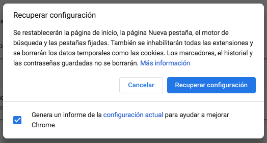
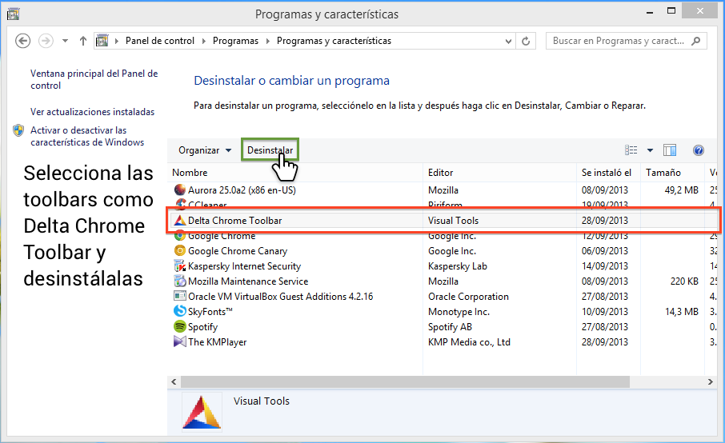
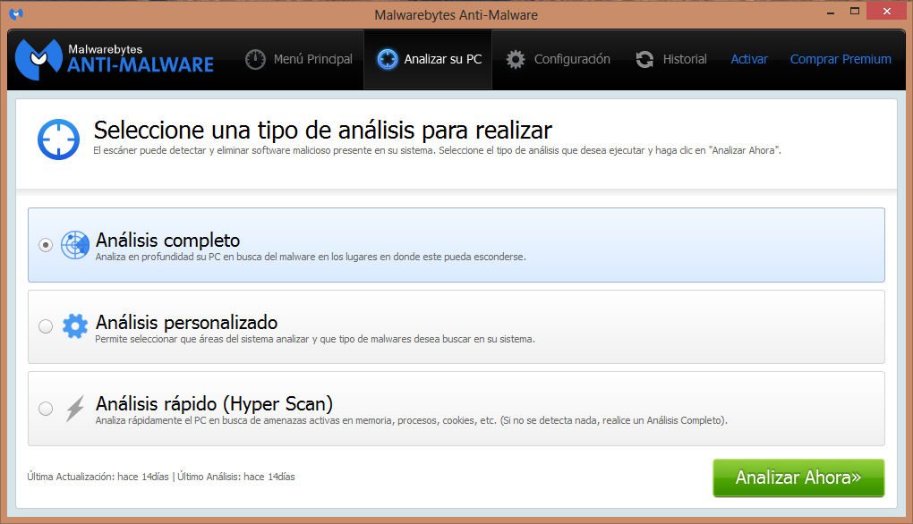
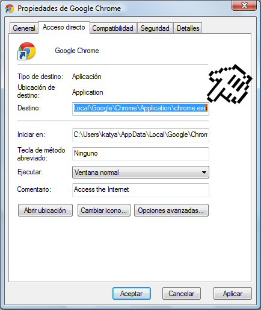

# Malware en Chrome – Publicidad, popups y buscadores/páginas de inicio modificadas
¡Hola a todos!

Si Chrome ha empezado a comportarse de una manera rara, a mostrar publicidad que dificulta la navegación, o no deja cambiar la configuración del buscador predeterminado o página de inicio, te propongo realizar los siguientes pasos con tal de solucionar el problema:

---

## 1. Inhabilitar extensiones de Chrome
Ve al **menú de Chrome** ( **⋮** ), **Más herramientas** y haz clic en **Extensiones**. En esa página inhabilita todas las extensiones.[^1] Para ello desmarca todas las casillas que hay en la esquina inferior derecha de la tarjeta de cada extensión. Si ahora Chrome se comporta normal, ve habilitando una a una las extensiones hasta dar con la que hace que Chrome se comporte tan raro. Cuando la encuentres, haz clic en el botón Eliminar para eliminarla.[^1]

---

## 2. Restablecer la configuración de Chrome
Ahora que hemos eliminado la extensión de Chrome podemos restablecer la configuración de Chrome siguiendo los pasos del siguiente artículo de ayuda:

- **[Cómo restablecer la configuración del navegador - Ayuda de Google Chrome](https://support.google.com/chrome/answer/3296214?hl=es)**

<div style="text-align: center;"></div>

---

Bien, esto debería ser suficiente para eliminar este malware de Chrome, pero en el caso de que todavía esté instalado en el ordenador, este volverá a instalar la extensión y/o modificar la configuración de Chrome. En caso de que ocurra esto, deberemos seguir con el siguiente paso:

---

## 3. Eliminar programas
El siguiente paso es desinstalar programas de tu ordenador que no reconozcas y que podrían ser el malware que provoca el comportamiento inesperado. Para ello, mira en la caja correspondiente al sistema operativo que uses:

!!! help "Eliminar programas en Windows"
    Para acceder al Panel de Control, sigue las siguientes instrucciones dependiendo del sistema operativo instalado (haz clic en tu sistema operativo de la lista):

    - [Windows 8 y Windows 10](https://support.microsoft.com/es-es/help/4028054/windows-10-repair-or-remove-programs#:~:text=Desinstalar%20o%20quitar%20aplicaciones%20y%20programas)
    - [Windows 7](https://support.microsoft.com/es-es/help/2601726)

    En el apartado de programas del Panel de Control desinstala todos los programas que no reconozcas y que tengan pinta de ser malware. Una búsqueda en Google[^2] del nombre podría ir bien para distinguir si un programa es una herramienta imprescindible de Microsoft o es malware.

    <div style="text-align: center;"></div>

    ¡Atención con los diálogos que aparecen al desinstalar los programas! A veces estos son engañosos, y como siempre hacemos clic a "sí", estos pueden incluir cosas como: "¿Quieres instalar <otro programa> durante la desinstalación?".

!!! help "Eliminar programas en Mac"
    Puedes aprender cómo desinstalar programas desde el siguiente artículo de ayuda:

    - [Instalar, actualizar y desinstalar apps en la Mac - Soporte técnico de Apple]()

Después de desinstalar los programas restablece otra vez la configuración de Chrome (paso 2).

¿Todavía no se solucionó? Hay malware que se deja desinstalar desde el Panel de Control o desde el Finder, pero desafortunadamente hay malware que se queda escondido en el ordenador y no quiere ser eliminado del ordenador. Pero tranquilo, ahora vamos a sacar nuestro as de la manga: el antimalware.

---

## 4. Escanea el equipo con un antimalware
Hay varias opciones. Primero de todo, estaría bien probar de ejecutar la herramienta de limpieza de Chrome. Esta está solo disponible para Windows, y viene incorporada con Chrome. Se puede acceder yendo al **menú de Chrome** ( **⋮** ), **Configuración**, abajo del todo **Configuración avanzada**, y de nuevo a bajo del todo haciendo clic en **Limpiar ordenador**. Luego, haz clic en **Buscar** para empezar la búsqueda y estate atento de lo que te diga el limpiador.

A parte, *Malwarebytes* es un antimalware que está disponible tanto para Windows como para Mac. Si Chrome Cleanup Tool no logró quitar el malware, puedes probar de hacer un escaneo con este. Puedes descargar la versión gratuita desde su página web oficial:

- [Malwarebytes: Anti-Malware Gratuito](https://es.malwarebytes.com/)

<div style="text-align: center;"></div>

Después de instalarlo, ábrelo, y en la pestaña analizar su PC selecciona la opción análisis completo y haz clic en analizar ahora. *(¡que tiemble el malware, estamos ejecutando un antimalware! ;)*

Algunos usuarios del Foro nos cuentan que los anteriores programas no logran eliminar cierto malware, pero sí que lo logran mediante un programa llamado AdwCleaner para Windows que se puede descargar desde el siguiente enlace:

- [Downloads - AdwCleaner - ToolsLib](https://toolslib.net/downloads/viewdownload/1-adwcleaner/)

Después de pasar el/los antimalware(s), restablece la configuración de Chrome de nuevo.

---

Finalmente, podría ser que cada vez que abres Chrome se abre una página específica, y esta no está definida en ningún sitio de la configuración de Chrome. En este caso debemos comprobar el icono de Chrome:

---

## 5. Comprueba el destino del icono de Chrome
Haz **clic derecho** en el icono de Chrome del escritorio y abre **Propiedades**. Allí abre la pestaña **Acceso directo** y comprueba que el campo **destino** no tenga una dirección web al final del todo. Si hay una URL escrita al final del campo, elimínala. [Esta animación](https://labs.avm99963.com/chrome/destino_chrome_shortcut.php) muestra dónde está el campo destino.

<div style="text-align: center;"></div>

---

## 6. Políticas en Chrome
En el caso de que nada de esto funcionara, puede ser que el malware haya establecido algunas políticas en Chrome. Un signo de que esté ocurriendo esto es que te aparezca el icono <i class="material-icons">business</i> en alguna parte de la configuración de Chrome o te aparezca algún mensaje del tipo "*Esta opción está administrada y no se puede eliminar ni inhabilitar*". Puedes encontrar si se ha establecido alguna política en Chrome abriendo la página `chrome://policy`. Si allí hay listada alguna política ilegítima, entonces te recomiendo ejecutar el siguiente programa que he creado que borra las carpetas de políticas de grupo de Windows y las políticas definidas en los registros de Windows automáticamente y las refresca para que tengan efecto en el ordenador inmediatamente sin tener que reiniciarlo.

Para ejecutar el programa sigue los siguientes pasos:

1. Descarga el archivo desde aquí (clic en el botón <i class="material-icons">get_app</i>)[^3]: [delete_chrome_policies_with_registry.bat - Google Drive](https://drive.google.com/file/d/1IOsF1Yey0QGKPxAtRfszCRvDNobcrBP5/view)
2. Abre la carpeta donde se encuentra el archivo descargado (clic en la flecha al lado de la descarga en la barra de descargas y clic en <span style="text-decoration: underline;">mostrar carpeta</span>).
3. Asegúrate de tener cerradas todas las ventanas de Chrome.
4. Haz clic derecho en el archivo `delete_chrome_policies.bat` y selecciona "***Abrir como administrador***".
5. Seguidamente, se abrirá una ventana con fondo negro donde se puede ir viendo el progreso.
    - Es posible que se muestre el error `El sistema no ha podido encontrar la clave o el valor del Registro especificados` al eliminar las políticas del registro, pero eso es solo porque se queja de que no existen políticas definidas en esa ruta del registro y por tanto no las puede eliminar, así que en realidad es normal.
    - Al acabar, pulsa cualquier tecla y se cerrará la ventana.
8. Abre en Chrome la página `chrome://policy`. Ahora no debería haber ninguna política activa (haz clic en el botón "*Volver a cargar políticas*" para asegurarte de que Chrome obtenga las políticas actualizadas).
Restablece la configuración de Chrome de nuevo.

---

¿Funcionó? ¿Algo del artículo no quedó del todo claro? Os animo a crear una [nueva publicación en el Foro](https://support.google.com/chrome/thread/new?hl=es) y los expertos del Foro de Chrome os intentaremos ayudar, pero por favor, <span style="text-decoration: underline;">**cuando publiquéis especificad que habéis seguido los pasos de este hilo y dejad la siguiente información**</span>:

```
Versión de Chrome:
Sistema Operativo:
Descripción detallada del problema y captura de pantalla:
Captura de pantalla de la página chrome://policy:
```

Puedes obtener información sobre tu versión de Chrome y sistema operativo desde la siguiente página web: [Versión de Chrome](https://labs.avm99963.com/chrome/version.php)

Además, puedes aprender cómo hacer una captura de pantalla y subirla al Foro en la siguiente página web: [Cómo insertar una captura de pantalla en los Foros de Google](https://labs.avm99963.com/chrome/screenshot.php)

Saludos :-)

[^1]: [Cómo administrar las extensiones - Ayuda de Google Chrome](https://support.google.com/chrome_webstore/answer/2664769?visit_id=637150564970188337-3151066646&hl=es&rd=2)
[^2]: [Cómo buscar como un profesional - Ayuda de Búsqueda web](https://support.google.com/websearch/answer/134479?hl=es&ref_topic=3180167)
[^3]: En determinadas ocasiones, si has iniciado sesión con la cuenta de Google de tu empresa o colegio, al abrir el enlace te dirá que me tienes que pedir permiso para descargar el archivo. Si es el caso, cierra la sesión momentáneamente o abre el enlace en una ventana de incógnito y te lo dejará descargar sin problemas.
