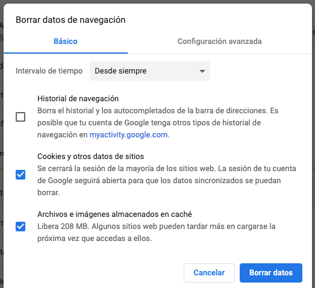
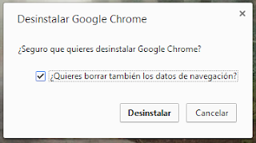
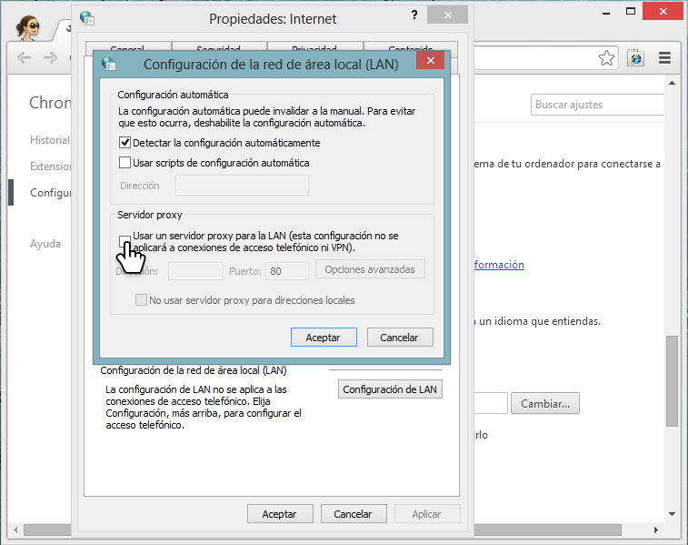
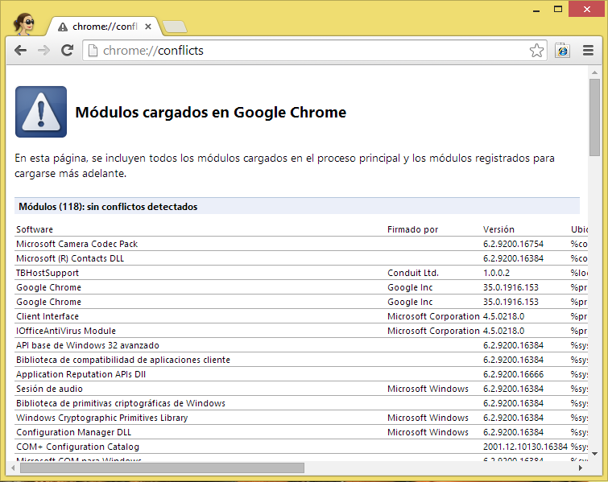

# Chrome no carga páginas web

¡Hola!

Este artículo va dedicado a cómo solucionar problemas con páginas web que no cargan o no se cargan correctamente en Chrome:

## 1. Vaciar caché y cookies
Antes de empezar vaciaremos la caché y borraremos las cookies[^1] ya que son un causante de este tipo de problemas. Para ello, iremos al **menú de Chrome** (el icono **`⋮`** de la parte superior derecha de Chrome), **Más herramientas**, **Borrar datos de navegación...**

Selecciona las casillas "***Cookies y otros datos de sitios***" y "***Archivos e imágenes almacenados en caché***", y sobretodo selecciona eliminar elementos almacenados **<span style="color: red;">desde siempre</span>**. Después haz clic en el botón "**Borrar datos de navegación**".

<div style="text-align: center;"><a href="../../img/deletecookies.png" target="\_blank" rel="noopener nofollow"></a><br><span style="color: gray;">[haz clic encima de las imágenes para hacerlas más grandes]</span></div>

## 2. Probar en modo incógnito
Probaremos con modo incógnito.[^2] Para ello haremos clic en el **menú de Chrome** (**`⋮`**) y seleccionaremos **Nueva ventana de incógnito**.

Si funciona en modo incógnito, significa que alguna extensión o configuración de Chrome nos está afectando. En los tres siguientes pasos se debería solucionar el problema. Si no, no te preocupes: todavía hay esperanzas de poder solucionar el problema.

## 3. Inhabilitar las extensiones
Las extensiones modifican el comportamiento del navegador, y a veces un mal desarrollo de estas puede provocar que se comporten de manera inesperada.[^3]

Para comprobar que ninguna de estas esté provocando el problema, seguid los siguientes pasos:

1. Accede a `chrome://extensions` (copia y pega esta URL en la barra de direcciones de Chrome y pulsa enter)
2. **Haz clic en el control deslizante** que hay en la esquina inferior derecha de la tarjeta de la primera extensión **para desactivarla**.
<div style="text-align: center;"><a href="../../img/inhabilitarextension.png" target="\_blank" rel="noopener nofollow"></a></div>
3. Prueba ahora si Chrome se comporta de la manera indeseada. Si todavía se comporta mal, **deberás inhabilitar la siguiente extensión, hasta encontrar la culpable**.
4. Cuando veas que Chrome ya se comporta correctamente, entonces has encontrado la extensión culpable. Haz clic en el botón **Eliminar** para eliminarla.[^3]

Si al inhabilitar todas las extensiones, Chrome se sigue comportando de una manera indeseada, eso significa que la fuente del problema no son las extensiones, sino otra cosa.

## 4. Restablecer configuración
Para restablecer la configuración de Chrome,[^5] abriremos el **menú de Chrome** (**`⋮`**), **Configuración**. Haremos clic en **Configuración avanzada** debajo del todo de la página y debajo del todo saldrá el botón **Restablecer la configuración del navegador**. Haremos clic, y en el diálogo que aparece haremos clic en el botón **Restablecer**/**Recuperar configuración**.

<div style="text-align: center;"><a href="../../img/resetchrome.png" target="\_blank" rel="noopener nofollow"></a></div>

## 5. Crear nuevo perfil de Chrome
Si nada de lo anterior solucionó el problema, crearemos otro perfil de Chrome.[^6] Para ello haremos clic en el **botón con la foto del usuario** que aparece justo a la izquierda del menú de Chrome, y haremos clic en el botón **Añadir**. En la ventana que aparece, introduciremos un nombre y haremos clic en el botón **Añadir**. Si funciona correctamente con el nuevo perfil podemos eliminarlo desde el icono de configuración del menú de los perfiles.

En el caso que ninguna página cargue, puedes crear un nuevo perfil de Chrome manualmente. Para ello hay que seguir los pasos del siguiente artículo de ayuda: [Cómo crear un nuevo perfil de usuario del navegador - Ayuda de Google Chrome](https://web.archive.org/web/20150920205106/https://support.google.com/chrome/answer/142059%3Fhl=es)

## 6. Comprobar la fecha y hora del ordenador – certificados

!!! bug "Esta sección está incompleta"
    Esta sección está copiada íntegramente de la [guía original](https://gpfarchive.avm99963.com/chrome-es/IafpyX5abJM.html), pero en el futuro se reescribirá para incluir detalles actualizados sobre los errores con certificados SSL/TLS.

Las páginas web seguras usan certificados para poder cifrar las conexiones desde tu ordenador hasta su servidor. El problema está en que estos certificados tienen una fecha de vencimiento, y si la fecha de tu ordenador está mal, el ordenador creerá que el certificado no es válido.

Para comprobar si el tiempo está correcto, se puede visitar la siguiente página web: [Comprobar fecha y hora](https://labs.avm99963.com/chrome/time.php)

En el caso de estar incorrecto, se debe cambiar a la actual. Además, si el problema que tienes tiene que ver con certificados, recomiendo leerse el siguiente artículo: [Solucionar errores de conexión - La conexión no es privada - Ayuda de Google Chrome](https://support.google.com/chrome/answer/6098869?hl=es#connection)

## 7. Reinstalar Chrome
Para reinstalar Chrome, primero lo desinstalaremos: [Cómo desinstalar Google Chrome - Ayuda de Google Chrome](https://support.google.com/chrome/answer/95319?hl=es)

En Windows, hay que asegurarse que marcamos la opción **¿Quieres borrar también los datos de navegación?** y en Linux la opción **Marcar para eliminar completamente**, si no la desinstalación no borrará todos los datos de Chrome y puede ser que algún dato corrupto siga provocando el problema aún después de desinstalar. En Mac se debe borrar la carpeta `Chrome` ubicada en `~/Library/Application Support/Google` para borrar los datos del usuario después de arrastrar la aplicación Chrome a la papelera.

Después podemos volver a instalar Chrome desde su página web: [Cómo descargar e instalar Google Chrome - Ayuda de Google Chrome](https://support.google.com/chrome/answer/95346?hl=es)

<div style="text-align: center;"><a href="../../img/uninstall.png" target="\_blank" rel="noopener nofollow"></a><br><span style="color: gray;">[haz clic encima de las imágenes para hacerlas más grandes]</span></div>

## 8. Comprobar configuración del cortafuegos (firewall)
En el caso de tener un programa de antivirus/cortafuegos instalado, es conveniente ver en su configuración si está bloqueando las conexiones entrantes y/o salientes de Chrome. En el caso de que no permita alguna de estas conexiones, hay que configurarlo para que sí que lo haga. Y en el caso de que no haya nada configurado para Chrome, hacer una excepción para que el cortafuegos acepte conexiones entrantes y salientes de Chrome.

## 9. Desactiva el proxy

!!! info "En Windows"
    Haz clic en el **menú de Chrome** (**`⋮`**), **Configuración**, **Configuración avanzada** y en la sección **Red** haz clic en el botón **Cambiar configuración del proxy...**, allí haz clic en el botón **Configuración de LAN** e inhabilita la casilla **Usar un servidor proxy para la LAN**.

    <div style="text-align: center;"><a href="../../img/proxy.png" target="\_blank" rel="noopener nofollow"></a></div>

!!! info "En Mac"
    Sigue los pasos del siguiente artículo de ayuda para desactivar el Proxy: [Introducir los ajustes del servidor proxy en el Mac](https://support.apple.com/es-es/guide/mac-help/mchlp2591/mac)

## 10. Comprueba si la página web funciona con otros navegadores
Es importante ver si la página web funciona con otros navegadores como [Firefox](https://www.mozilla.org/es-ES/firefox/new/).

Si la página funcionaba con Internet Explorer pero no con Firefox o Chrome, es muy probable que esa página web esté diseñada para que funcione solo con Internet Explorer. Antes los desarrolladores diseñaban las páginas web para que funcionasen con Internet Explorer, pero Internet Explorer ha sido un navegador que no ha cumplido con varios estándares de la web, y por consecuencia esas páginas web no funcionan en otros navegadores. La solución sería instalar y usar la extensión IE Tab con esa página web (por el momento solo funciona en Windows): [Chrome Web Store - IE Tab](https://chrome.google.com/webstore/detail/ie-tab/hehijbfgiekmjfkfjpbkbammjbdenadd?hl=es)

Si experimentas problemas similares para cargar páginas en varios navegadores en tu ordenador, te dejamos algunas sugerencias:

1. Intenta visitar otra página web: puede que simplemente la que estás intentando ver esté temporalmente caída.
2. Cierra otros programas que hayas abierto en tu ordenador: puede que ellos estén consumiendo mucha memoria, haciendo que los navegadores funcionen con lentitud.
3. Reinicia el ordenador.


## 11. Busca mensaje de error
Si aparece algún mensaje de error, nunca está de más leerse las sugerencias que se incluyen en la página.

Además, este artículo recomienda soluciones a errores comunes para cada mensaje de error:

- [Solucionar errores de conexión - Ayuda de Google Chrome](https://support.google.com/chrome/answer/6098869)

## 12. Comprueba la configuración de contenido
Entra al **menú de Chrome** (**`⋮`**), **Configuración**. Haz clic en **configuración avanzada** y en la sección **Privacidad** haz clic en **Configuración de contenido...**. Allí comprueba si está habilitado Javascript, las imágenes, las cookies, etc. Lo mejor sería que tuvieras configurado todas las opciones a la opción **recomendada**. Además, haz clic en los botones **Administrar excepciones...** para ver si hay establecida alguna excepción y eliminarla en caso de que creas que hace que una página no cargue correctamente.[^9]

## 13. Inhabilita temporalmente el DNS
Entra al **menú de Chrome** (**`⋮`**), **Configuración**. Haz clic en **configuración avanzada** y en la sección **Privacidad** deselecciona la opción **Predecir las acciones de la red para cargar las páginas más rápido**.[^7]

Si esto no resuelve el problema, lo recomendable es volver a seleccionar la opción.

## 14. Comprueba los conflictos con Chrome (solo Windows)
Si usas Windows, abre la página `chrome://conflicts` y comprueba si algún módulo ha entrado en conflicto con Chrome.[^8]

<div style="text-align: center;"><a href="../../img/chromeconflicts.png" target="\_blank" rel="noopener nofollow"></a></div>

## 15. Verifica la posible presencia de software malintencionado
Nunca va mal comprobar si malware ocasionó el problema.

Mira este vídeo de YouTube que explica sobre cómo detectar el malware:

<div>
  <div style="margin-top: 1em; margin-bottom: 1em; overflow: auto">
    <a href="https://www.youtube.com/watch?v=nvIXGeB1WgE" rel="nofollow noopener" style="margin-right: 1em; margin-bottom: 1em; color: rgb(119,89,174); min-height: 90px; overflow: hidden; display: block; float: left; width: 120px; background:url('http://i3.ytimg.com/vi/6UtURLtDWsU/hqdefault.jpg') 50% 50%/100% no-repeat;"></a>
    <div>
      <div style="color: rgb(36,93,193)"><a href="https://www.youtube.com/watch?v=nvIXGeB1WgE" rel="nofollow noopener">Tres consejos para detectar software malicioso</a></div>
      <div style="margin-top: 1em; color: rgb(119,119,119); min-height: 50px">Google</div>
    </div>
  </div>
</div>

Además, échale un vistazo también a la siguiente página web y al siguiente artículo que explican cómo eliminar el malware:

- [Consejos para utilizar Internet de forma más segura](https://safety.google/intl/es/security/security-tips/)
- [Malware en Chrome – Publicidad, popups y buscadores/páginas de inicio modificadas](malware.md)

## 16. Restablece el archivo hosts
Puede ser que se haya editado el archivo hosts haciendo que algunas páginas web no se puedan cargar porque los dominios de esas páginas web apuntan a direcciones IP que no existen.

Para restablecer este archivo a su valor predeterminado, se pueden seguir los siguientes pasos:

- [¿Cómo puedo restablecer el archivo Hosts al valor predeterminado?](http://support.microsoft.com/kb/972034/es) (Windows)
- [Archivo hosts - Wikipedia, la enciclopedia libre](http://es.wikipedia.org/wiki/Archivo_hosts)

## 17. Configura los DNS de Google
Los servidores DNS son servicios que traducen nombres de páginas (ej: `example.com`) a números (ej: `203.0.113.254`). Así el ordenador sabe dónde tiene que mandar la solicitud para obtener el contenido de la página web.

A veces los servidores DNS pueden funcionar incorrectamente o bloquear el acceso a determinados sitios web. Así pues, este podría ser el origen del error.

Los DNS de Google son muy fiables y no bloquean ninguna página web. Por eso, configurarlos puede resolver tu problema. Para configurarlos sigue las instrucciones de la siguiente página:

- [DNS Público | Desarrolladores de Google](https://translate.google.com/translate?sl=auto&tl=es&hl=en&ie=UTF-8&u=https%3A%2F%2Fdevelopers.google.com%2Fspeed%2Fpublic-dns%2Fdocs%2Fusing) (traducido por Google Traductor)
- [Public DNS | Google Developers](https://developers.google.com/speed/public-dns/docs/using) (versión original en inglés)

---

¿Nada de esto funcionó? Si nada de nada funcionó, os animo a crear una [nueva publicación en el Foro](https://support.google.com/chrome/thread/new?hl=es) y los expertos del Foro de Chrome os intentaremos ayudar, pero por favor, <span style="text-decoration: underline;">**cuando publiquéis especificad que habéis seguido los pasos de este hilo y dejad la siguiente información**</span>:

```
Versión de Chrome:
Sistema Operativo:
Descripción detallada del problema y captura de pantalla:
Captura de pantalla de la página chrome://policy:
```

Puedes obtener información sobre tu versión de Chrome y sistema operativo desde la siguiente página web: [Versión de Chrome](https://labs.avm99963.com/chrome/version.php)

Además, puedes aprender cómo hacer una captura de pantalla y subirla al Foro en la siguiente página web: [Cómo insertar una captura de pantalla en los Foros de Google](https://labs.avm99963.com/chrome/screenshot.php)

Saludos :-)

<span style="font-size: small;">Este artículo es una recopilación/adaptación de los hilos [Solución importante para el 90% de los problemas con sitios web, ¡incluyendo FACEBOOK!](https://gpfarchive.avm99963.com/chrome-es/11VdI_NxAck.html) creado por Alejandro Silvestri y [Chrome carga lento o no carga páginas](https://gpfarchive.avm99963.com/chrome-es/YWsCn16ZAtU.html) creado por Ernest Pro, con nuevos contenidos, gracias a la colaboración de todos los Colaboradores Principales y Usuarios Destacados del Foro de Chrome en español.</span>

<span style="font-size: small;">Anteriormente este artículo era un hilo que tuvo 182 comentarios, pero ese hilo desapareció debido a la migración de plataforma de los Foros de Google. Puedes consultar una copia del hilo original [aquí](https://gpfarchive.avm99963.com/chrome-es/IafpyX5abJM.html) (el contenido allí no está actualizado).</span>

[^1]: [Cómo eliminar la caché y otros datos del navegador - Ayuda de Google Chrome](http://support.google.com/chrome/bin/answer.py?hl=es&answer=95582)
[^2]: [Cómo utilizar el modo de incógnito (navegación privada) - Ayuda de Google Chrome](https://support.google.com/chrome/answer/95464?hl=es)
[^3]: [Cómo administrar las extensiones - Ayuda de Google Chrome](https://support.google.com/chrome/answer/187443?hl=es)
[^5]: [Cómo restablecer la configuración del navegador - Ayuda de Google Chrome](https://support.google.com/chrome/answer/3296214?hl=es)
[^6]: [Cómo administrar a varios usuarios en Chrome - Ayuda de Google Chrome](https://support.google.com/chrome/answer/2364824?hl=es)
[^7]: [Cómo aumentar la velocidad de carga de las páginas (carga previa) - Ayuda de Google Chrome](https://support.google.com/chrome/answer/1385029?hl=es)
[^8]: [Software que produce fallos en Google Chrome - Ayuda de Google Chrome](https://web.archive.org/web/20140924045047/https://support.google.com/chrome/answer/185112?hl=es)
[^9]: [Cómo ajustar las imágenes, JavaScript y otras opciones de contenido web - Ayuda de Google Chrome](https://support.google.com/chrome/answer/114662?hl=es)
