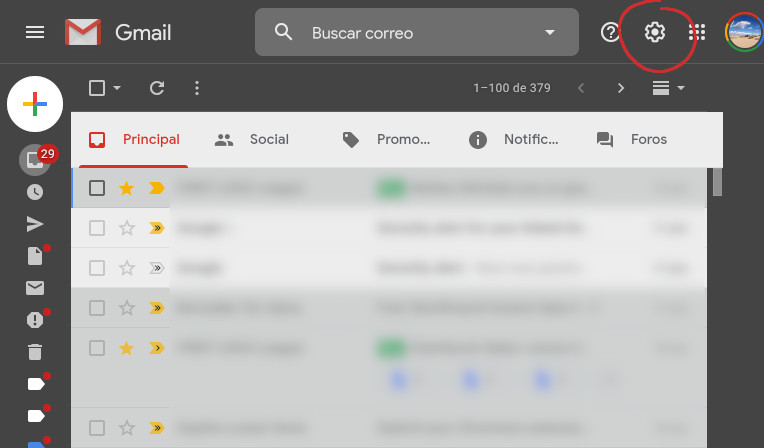
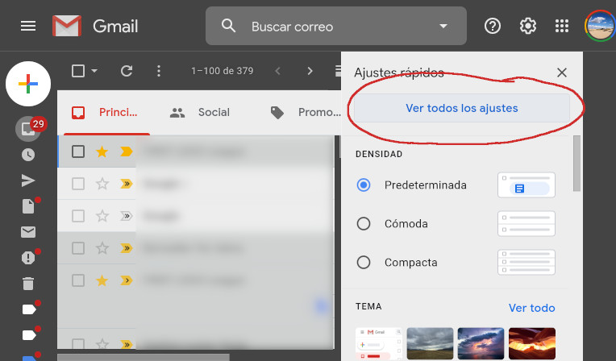
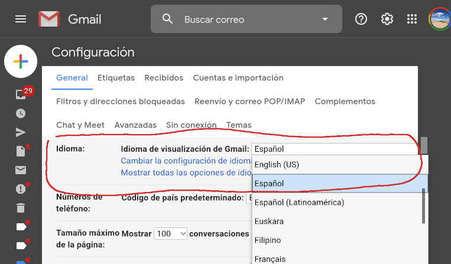

# Cómo cambiar el idioma de Gmail de vuelta al español

Para cambiar el idioma de Gmail de vuelta al español, sigue los siguientes pasos: (guíate por lo que muestran las imágenes, ya que el texto evidentemente estará en otro idioma)

1. Abre **[Gmail](https://mail.google.com/)**.
2. Haz clic en el **icono con la rueda dentada** de la esquina superior derecha de la página.
   

3. Luego, haz clic en el botón grande **Ver todos los ajustes**, que aparece al principio del todo de la barra lateral derecha que se abre.
   

4. Finalmente, en la pantalla que aparece, selecciona el idioma **Español** en el primer selector.
   

